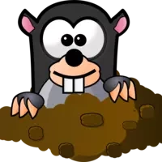

<!--<div>
  <div align="center">
     
  </div>
  <br>
  <div>
    <h1 style="text-align: center;">Welcome to Whack-a-mole!</h1>
  </div>
  <br>
  <br>
</div>-->

# Welcome to Whack-a-mole!

## [Whack-a-mole](https://drubach.github.io/https:Whack-a-mole/) is a fun game meant to test your reflexes. Designed primarily for chldren between 5 and 13 years of age. Features include easy to operate controls, 3 levels of difficulty, entertaining images and sounds, with a cartoonish fun atmosphere.


## [View the Whack-a-mole page](https://drubach.github.io/https:Whack-a-mole/)


## Table of Contents
1. [**UX**](#ux)
    - [**Project Goals**](#project-goals)
    - [**Player goals**](#player-goals)
    - [**Parental goals**](#parental-goals)
    - [**Developer and Business Goals**](#developer-and-Business-Goals)
    - [**User Stories**](#user-stories)
    - [**Design choices**](#design-choices)
    - [**Wireframes**](#wireframes)

2. [**Features**](#features)
    - [**Existing Features**](#existing-features)
    - [**Features Left to Implement**](#features-left-to-implement)

3. [**Technologies used**](#technologies-used)

4. [**Testing**](#testing)

5. [**Deployment**](#deployment)
    - [**How to run this project locally**](#how-to-run-this-project-locally)

6. [**Credits**](#credits)
    - [**Content**](#content)
    - [**Media**](#media)
    - [**Code**](#code)
    - [**Acknowledgements**](#acknowledgements)

7. [**Disclaimer**](#disclaimer)

## UX

### Project Goals

The primary goal of Whack-a-mole is to provide a fun, child friendly game to entertain it's users.
It has two target audiences: School aged children 5 to 13 and their parents. 

#### Player goals

The target audience for this game is children aged 5 to 13 years old.

Players goals are:
- A fun game to play.
- Child friendly controls.
- All controls laid out intuitively. 
- Entertaining images and sound with a rewarding experience when improvements are made.

Whack-a-mole meets these needs because:
- The design is visually appealing, using these user goals as design parameters.
- Controls are logically grouped, large and the use is easily interpreted.
- Colors lean towards the primary and are therefore stimulating and icons are simple and clear. 
- Audio is not overbearing, yet provides an additional reward for successful game play.

#### Parental goals

Parents are concerned about the amount of time children can spend playing computer games and want to be able to control 
identification and saving of information their child might enter into a website. 

Parent's goals are:
- Ability to reset or delete a stored player profile.
- A fun, well-functioning game that can be extended in its' use so additional games don't need to be purchased. 
- The ability to limit the time spent to finish a game.

Whack-a-mole meets these needs by:
- There is a reset data option that is easy to operate. 
- The game includes 3 levels of difficulty (slow, med, fast) and will store high scores if desired.
- Each game is timed for 30 seconds.

#### Developer and Business Goals

- An appealing and functional website that works as expected and provides a rewarding, fun experience for the user.
- An educational experience in the development of an interactive website using Javascript.
- A valuable example for the developers portfolio.

#### User Stories

As a player aged between 5-13 years old, I want:
1. Easily understood and operated controls.
2. Responsive and functional on all devices.
3. Feedback to know when I have been successful or not.
4. An ability to increase the challenge when my abilities improve.
5. Positive feedback when I hit a new high score.
6. Appealing icons and images that I can understand.
7. The ability to save high scores, so I can try to beat them.

As a parent of a player, I want:
1. Levels of difficulty choose from. 
2. An appealing game, so that my child and I can have a positive experience when using it.
3. The ability to easily remove a stored profile.
6. To know who developed the game and to be able to contact them easily. 

### Design Choices

Design choices were made to be visually appealing to young users easy to navigate and play the game. 

**Fonts**

- The primary font **XXXXX** was chosen 

- The secondary font **YYYYY** was chosen f

**Icons**

**Colours**

**Styling**

**Backgrounds**

**Mole, Grass and Hammer images**


**Audio files**

### Wireframes

These wireframes were created using [Balsamiq](https://balsamiq.com/). during the Scope Plane part of the design and planning process for this project. 

- [User info modal]()
- [Game page]()
- [Reset popup]()
- [New high score popup]()
- [Game complete popup]()

## Features
 
### Existing Features

1. **Player info modal**

<div align="center">

</div>


2. **Dashboard**
    
<div align="center">
<br>

</div>

3. **Player info display**

4. **Difficulty selection buttons**

5. **Character selection buttons**
    
6. **Reset button**

7. **Info button**

<div align="center">

</div><br>

9. **Parental check modal**

<div align="center">

</div>


10. **Hits counter**


11. **Game board and images**

<div align="center">

</div>


12. **Win modals** 

<div align="center">

</div>


13. **Footer tab**
 
### Features Left to Implement


## Technologies Used

- This project uses HTML, CSS and JavaScript programming languages.
- [HTML5](https://en.wikipedia.org/wiki/HTML5)
- [CSS3](https://en.wikipedia.org/wiki/Cascading_Style_Sheets)
- [Javascript](https://en.wikipedia.org/wiki/JavaScript)
- [JQuery](https://jquery.com)
    - The project uses **JQuery** to simplify DOM manipulation.
- [Gitpod](https://gitpod.io) 
    - Developer used **Gitpod** for their IDE while building the website.
- [Bootstrap](https://www.bootstrapcdn.com/)
    - The project uses **Bootstrap** to simplify the structure of the website and make the website responsive easily.
    - The project also uses Bootstrap to provide icons from [FontAwesome](https://www.bootstrapcdn.com/fontawesome/)
- [Google Fonts](https://fonts.google.com/)
    - The project uses **Google fonts** to style the website fonts.
- [Jasmine](https://jasmine.github.io/)
    - This project used **Jasmine** to automatically test all JavaScript and jQuery code.
- [Jasmine-jQuery](https://github.com/velesin/jasmine-jquery)
    - This project used **Jasmine-jQuery** CDN to make it possible to test jQuery code using Jasmine.
- [GitHub](https://github.com/)
    - This project uses **GitHub** to store and share all project code remotely. 
    - The **Code Insititue Full Template** was used as the base of the project and Eventyret's Bootstrap 4 extension was used to generate the boilreplate HTML file. [CI Full Template](https://github.com/Code-Institute-Org/gitpod-full-template)
- [Photoshop](www.adobe.com/Photoshop)
    - This project used tools in **Photohshop** to edit, crop and save images as well as ulitising the colour picker to ensure color consistency over the entire project.
- [Browserstack](https://www.browserstack.com/)
    - The project used **Browserstack** to test functionality on all browsers and devices.
- [EZ-gif:](https://ezgif.com/png-to-webp)
    - The original images were converted to webp format to save space and speed the loading of the web pages using this online service.


## Deployment

This project was developed using the [Gitpod IDE](https://gitpod.io), committed to git and pushed to GitHub using the built in function within cloud9. 

To deploy Concentration! to GitHub Pages from its [GitHub repository](https://github.com/drubach/Whack-a-mole), the following steps were taken: 
1. Log into GitHub. 
2. From the list of repositories on the screen, select **DRubach/**.
3. From the menu items near the top of the page, select **Settings**.
4. Scroll down to the **GitHub Pages** section.
5. Under **Source** click the drop-down menu labelled **None** and select **Master Branch**
6. On selecting Master Branch the page is automatically refreshed, PicFlip! is now deployed. 
7. Scroll back down to the **GitHub Pages** section to retrieve the link to the deployed website.

The Branches were used in the development of Whack-a-mole with the Master being the deployed version at all times.

### How to run this project locally

To clone this project from GitHub:
1. Follow this link to the [Concentration GitHub repository](https://github.com/drubach/Whack-a-mole).
2. Under the repository name, click "Clone or download".
3. In the Clone with HTTPs section, copy the clone URL for the repository. 
4. In your local IDE open Git Bash.
5. Change the current working directory to the location where you want the cloned directory to be made.
6. Type ```git clone```, and then paste the URL you copied in Step 3.
```console
git clone https://github.com/USERNAME/REPOSITORY
```
7. Press Enter. Your local clone will be created.

Further reading and troubleshooting on cloning a repository from GitHub [here](https://help.github.com/en/articles/cloning-a-repository).

## Credits

### Content

- All text in this project was written by the developer.

### Media

#### Images
- The screenshots of the application were created by the developer.
- The mole was taken from [openclipart.org](https://openclipart.org/image/2400px/svg_to_png/168496/mole2.png).
- The grass was taken from [cliparts.co](http://cliparts.co/cliparts/rTL/oR8/rTLoR88zc.jpg.)
- The hammer image was taken from [freepngclipart.com](http://freepngclipart.com/download/hammer/85555-cute-hammer-cartoon-hq-image-free-png.png).
- The star image is from [clipartartqueen.com](https://www.clipartqueen.com/image-files/cartoon-star.png).
- The boot image was taken from [clipartart.com](https://clipartart.com/images/brown-boots-clipart-8.png).
- The top hat image is from [clipartmag.com](http://clipartmag.com/images/top-hat-clipart-36.jpg).
- The trophy image is from [png.pngtree.com](https://png.pngtree.com/png-vector/20191009/ourlarge/pngtree-trophy-vector-illustration-isolated-on-white-background-trophy-clip-art-png-image_1788588.jpg)
- The thumbs up image is taken from [clipartkey.com](https://www.clipartkey.com/mpngs/m/186-1864825_like-png-thumbs-up-cartoon-yellow.png)

- The comic-book style modal backgrounds were sourced from [freepik](https://www.freepik.com)
- The game board background photograph was obtained from [Jason Leung on Unsplash](https://unsplash.com/photos/M55JcA9wOG0).

#### Audio
- The sound clips for a hit and a miss are from [SoundJay](https://www.soundjay.com).

### Code
- The read me was created by editing this [sample readme](https://github.com/Code-Institute-Solutions/SampleREADME) from Code Institute.
- A significant portion of the code for this project was copied and edited from the previous projects I completed in the program.
- Code for the game board grid was based upon guidance from the site [css-tricks.com](https://css-tricks.com/snippets/css/complete-guide-grid/).


### Acknowledgements

Special thanks to: 
- Code Institute Mentor **Caleb Mbakwe** for his time and support in the production of this project.
- My son, **Jacob Rubach** who is also a student in this program.
- Tutor support at Code Institute for their support.

#### Disclaimer
This website and all content are for educational purposes only.
